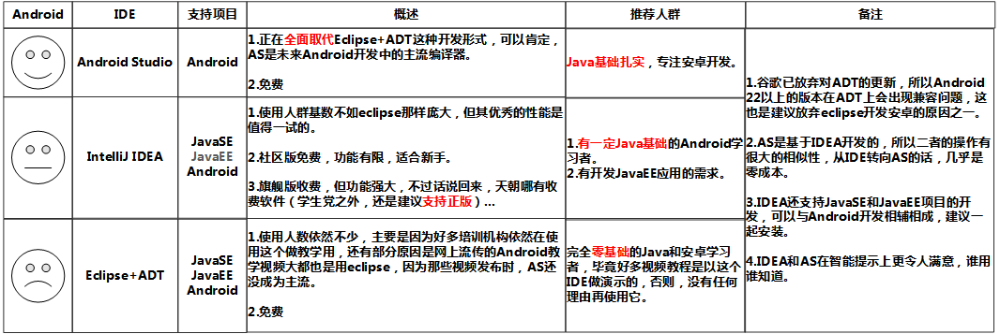
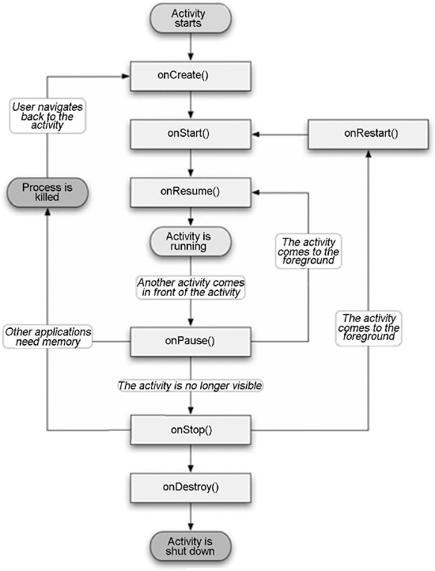
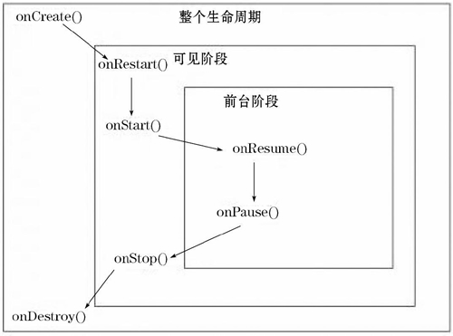
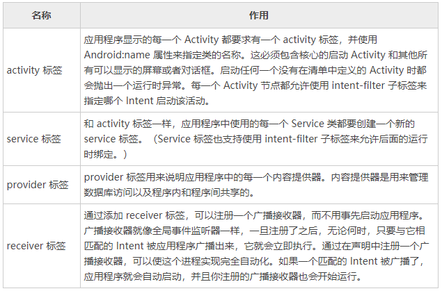

##  1 Android架构

- Android底层内核空间以Linux内核作为基础，上层用户空间由Native系统库、虚拟机运行环境、框架层组成，通过系统调用Syscall连通系统的内核空间和用户空间；
- 用户空间主要采用C++和Java编写，通过JNI（Java Native Interface，Java本地接口）技术打通用户空间的Java层和Native层（C/C++），从而连通整个系统。

 

 

Android系统启动过程：BootLoader引导开机 -> Kernel -> Native -> Framework -> APP

```java
/*---Loader层---*/
(1)Boot ROM:当手机处于关机状态时，长按Power键开机，引导芯片开始固化在ROM中的预设代码开始执行，然后加载引导程序到RAM;
(2)Boot Loader：启动Android系统之前的引导程序，主要检查RAM，初始化硬件参数等。
```

### 1.1 Linux内核层

- Android平台的基础是Linux内核；
- Linux内核的安全机制为Android提供相应保障，也允许设备制造商为内核开发硬件驱动程序。

```php
(1)启动swapper进程（pid=0）：即idle进程，系统初始化过程Kernel由无到有创建的第一个进程，用于初始化进程管理、内存管理，加载Display、Camera Driver等相关工作;
(2)启动kthreadd进程（pid=2）：Linux系统的内核进程，所有内核进程的鼻祖，会创建内核工作线程kworkder、软中断线程ksoftirqd、thermal等内核守护进程。
```

### 1.2 硬件抽象层HAL

 HAL 包含多个库模块，其中每个模块都为特定类型的硬件组件实现一组接口， 当框架API请求访问设备硬件时，Android系统将为该硬件加载相应的库模块。 

### 1.3 Native系统库和Android Runtime（ART）

#### 1.3.1 Native系统库

- Native系统库主要是C/C++编写的原生库，以供Android系统的各个组件使用。；
- 主要包括init孵化来的用户空间的守护进程、HAL层以及开机动画等 。

```php
系统C语言库 libc的BSD衍生，调整为基于嵌入式Linux设备
SGL       内置的2D图形引擎
SQLite    强大且轻量级的关系数据库引擎    
```

```php
(1)启动init进程（pid=1）：用户进程，所有用户进程的鼻祖;
(2)init进程会孵化出ueventd、logd、healthd、installd、adbd、lmkd等用户守护进程；
(3)init进程还启动servicemanager(binder服务管家)、bootanim(开机动画)等重要服务
(4)init进程孵化出Zygote进程，Zygote进程是Android系统的第一个Java进程(即虚拟机进程)，Zygote是所有Java进程的父进程。
```

#### 1.3.2 Android Runtime（ART）

-  每个应用都在其自己的进程中运行，都有自己的虚拟机实例；
- ART通过执行DEX文件可在设备运行多个虚拟机，DEX文件是一种专为Android设计的字节码格式文件，经过优化，使用内存很少；
- ART主要功能包括：预先(AOT)和即时(JIT)编译，优化的垃圾回收(GC)，以及调试相关的支持。 

### 1.4 Java框架层

 框架层以 Java 类的形式为应用程序提供许多高级的服务。 

### 1.5 应用层

## 2 Android开发环境搭建

https://www.cnblogs.com/kangjianwei101/p/6290200.html

开发工具：Android SDK

集成开发环境：Eclipse+ADT；Eclipse ADT（集成）； IntelliJ IDEA；Android Studio



eclipse的workspace≈Android Studio的project

eclipse的project≈Android Studio的module


ADT（Android Development Tools，安卓开发工具）：在Eclipse安装ADT插件，该插件可以让Eclipse和Android SDK关联起来


- 方式一：JDK+Eclipse+ADT+SDK（基本已经不再使用）

https://www.jb51.net/article/71912.htm

https://www.cnblogs.com/zoupeiyang/p/4034517.html

- 方式二：JDK+Android Studio


 https://zhuanlan.zhihu.com/p/80051318


### 2.1 Android Studio

Android Studio了解：https://www.bilibili.com/video/BV1v741157vB?p=1

- 基于IntelliJ IDEA，类似Eclipse ADT，提供了集成的Android开发工具用于开发和调试；
- 基于Gradle的构建支持；

```
本机安装目录：C:\Program Files\Android\Android Studio
```

### 2.2 Android SDK

- SDK（Software Development Kit，软件开发工具包）：用于为特定的软件包、软件框架、硬件平台、操作系统等建立应用软件的开发工具的集合；

- Android SDK：Android专属的软件开发工具包，采用Java语言，需要安装JDK 5.0以上版本；

- | Android SDK Tools          | 一般最新版本                                                 |
  | -------------------------- | ------------------------------------------------------------ |
  | Android SDK Platform-tools | Android公用平台开发和调试工具，如adb、fastboot等，一般最新版本 |
  | Android SDK Build-tools    | 编译工具，包含了转化为davlik虚拟机的编译工具<br />理论上最新版本即可，但导入旧版构建工具的工程时，可能需要对应版本的bulid-tools，可以安装多个版本 |
  |                            |                                                              |
  | **Android SDK Platform**   | 对应平台的开发工具，最新版本即可，因为向下兼容               |

  

```
本机安装目录：C:\Users\wh\AppData\Local\Android\Sdk
本机是在安装Android Studio过程中自动下载安装的
```

## 3 Android程序结构

- Android作为移动设备的开发品台，其软件层次结构包含操作系统、中间件和应用程序；
- Android应用程序通常涉及和用户交互，Android本身提供了桌面、联系人、电话、浏览器等众多核心应用，同时允许开发者使用应用程序框架层的API实现自己的程序；
- Android系统没有常见的应用程序入口的方法（如Java语言中的main()方法，应用程序由**组件**组成，组件可以调用相互独立的功能模块；
- 根据完成功能不同，Android划分了四类核心组件，即Activity、Service、BroadcastReceiver和ContentProvider，各组件之间的消息传递通过Intent完成。

### 3.1 四大组件

#### 3.1.1 Activity

- 最基本的核心组件，用户和应用程序交互的窗口 ；
- 一个Android应用程序由一个或多个Activity组成，但只有一个主Activity，一个Activity通常对应一个视图；
- Activity相当于Web应用程序中的网页，用于显示信息，并且相互之间可以跳转；
- 新打开一个视图时，之前的视图被置为暂停状态，并且压入历史堆栈中，用户可以通过回退操作返回以前打开过的视图；
- Activity由Android系统进行维护，有自己的生命周期，即“产生、运行、销毁”。

#### 3.1.2 Service

- 类似于Activity但没有视图的程序，只能在后台运行，可以与其它组件交互；
- 举例：打开音乐播放器播放音乐时，又打开浏览器，此时歌曲播放并未停止，而是在后台继续播放，这个播放即由播放音乐的Service控制；
- （1）本地Service：只能承载该Service的应用程序访问的组件；（2）远程Service：供在设备上运行的其他应用程序远程访问的Service；
- Context.startService(Intent service)启动一个Service，Context.bindService()绑定一个Service。

#### 3.1.3 BroadcastReceiver

- 广播接收者，即用于接收来自系统和其他应用程序的广播，并作出回应（应用程序之间传输信息的机制）；
- Android系统中，当有特定时间发生时产生相应的广播；如（1）开机过程完成后，系统产生一条广播，接收到这条广播就能实现开机启动服务的功能；（2）电池电量改变时，系统产生一条广播，接收到这条广播就能在电量低时告知用户及时保存进度等；
- 注册方式：（1）在AndroidManifest.xml中进行静态注册；（2）在运行的代码中使用Context.registerReceiver()进行动态注册；
- 只要注册了BroadcastReceiver，即使对应的事件广播来临时应用程序未启动，系统也会自动启动该应用程序对事件进行处理。

#### 3.1.4 ContentProvider

- Android提供的第三方应用数据的访问方案；
- 文件、数据库等数据在Android系统中私有，仅允许被特定应用程序直接使用，在两个程序之间的数据交换或共享由ContentProvider实现。

### 3.2 Activity组件

#### 3.2.1 Android的生命周期

（1）运行态：Activity运行于屏幕的最上层并且获得用户焦点。

（2）暂停态：当前Activity依然存在，但是没有获得用户焦点。

​        在其之上有其他的 Activity 处于运行态，但是由于处于运行态的 Activity 没有遮挡住整个屏幕，当前 Activity 有一部分视图可以被用户看见。处于暂停态的 Activity 保留了自己所使用的内存和用户信息，但是在系统极度缺乏资源的情况下，有可能会被杀死以释放资源。

（3）停止态：当前 Activity 完全被处于运行态的 Activity 遮挡住，其用户界面完全不能被用户看见。

​        处于停止态的 Activity 依然存活，也保留了自己所使用的内存和用户信息，但是一旦系统缺乏资源，停止态的 Activity 就会被杀死以释放资源。

```java
//Activity从一种状态切换到另一种状态会激发相应的回调方法
onCreate(Bundle savedInstanceState);//创建Activity时调用；以 Bundle 的形式提供对以前储存的任何状态的访问，savedInstanceState 对象是用于保存 Activity 的对象的状态
onStart();   //Activity变为在屏幕上对用户可见时调用
onResume();  //开始和用户交互时调用（无论是启动还是重启一个应用）
onPause();   //激活其他Activity时调用，暂停或收回CPU时调用
onStop();    //停止Activity并转为不可见阶段
onRestart(); //重新启动已经停止的Activity
onDestroy(); //完全从系统内存中移除Activity;该方法被调用可能是因为有人直接调用 finish() 方法或者系统决定停止该活动以释放资源

//启动Activity：onCreate、onStart、onResume
//Activity失去焦点：onPause、onStop 
//Activity重获焦点：onRestart、onStart、onResume
//关闭 Activity：onPause、onStop、onDestroy。
```





#### 3.2.2 Activity的创建

（1）新建类

创建 Android.app.Activity（或者它的一个已经存在的子类）的一个子类，并重写 onCreate() 方法。

（2）关联布局XML文件

在 res/layout 目录中新建一个 XML 布局文件，可以通过 setContentView() 来指定 Activity 的用户界面的布局文件。

（3）注册

在 AndroidManifest.xml  文件中对建立的 Activity 进行注册，即在 <application> 标签下添加 <activity> 标签，对于主 Activity，要为其添加 <intent-filter> 标签。

```xml
<?xml version="1.0" encoding="utf-8"?>
<manifest xmlns:android="http://schemas.android.com/apk/res/android"
    package="com.example.helloworld">

    <application
        android:allowBackup="true"
        android:icon="@mipmap/ic_launcher"
        android:label="@string/app_name"
        android:roundIcon="@mipmap/ic_launcher_round"
        android:supportsRtl="true"
        android:theme="@style/Theme.HelloWorld">
        <activity android:name=".MainActivity">
            <intent-filter>
                <action android:name="android.intent.action.MAIN" />
                <!--该 Activity 作为主 Activity 出现-->
                <category android:name="android.intent.category.LAUNCHER" />
                <!--改Activity会被显示在最上层的启动列表中-->
            </intent-filter>
        </activity>
    </application>

</manifest>
```

**AndroidManifest.xml**

- 每个Android项目都包含一个清单（Manifest）文件 AndroidManifest.xml；
- 程序声明文件，必须包含于根目录下；
- 包含Android系统运行程序前必须掌握的重要信息，包含应用程序名称、图标、包名称、模块组成等；
- 除了 <manifest> 和 <application> 标签是必需的，其他标签都可按情况添加。

```
（1）manifest标签：根标签，用于设置与项目相关的一些属性。比如用于唯一标识应用程序的 package 属性，用于记录应用程序版本的 Android:versionName 属性等。xmlns:Android 属性必须被定义为“http://schemas.Android.com/apk/res/Android”。

（2）Application标签：manifest标签仅能包含一个application标签。使用各种属性来指定应用程序的各种元数据（包括标题、图标和主题）；还可以作为一个包含活动（Activity）、服务（Service）、内容提供器（Provider）和广播接收器（Broadcast Receiver）标签的容器，用来指定应用程序组件。

3) uses-permission 标签
作为安全模型的一部分，uses-permission 标签声明了那些自己定义的权限，而这些权限是应用程序正常执行所必需的。在安装程序时，设定的所有权限将会告诉用户，由他们来决定同意与否。

4) permission 标签
在可以限制访问某个应用程序组件之前，需要在清单中定义一个 permission。在 permission 标签内，可以详细指定允许的访问权限的级别（normal、dangerous、signature和signatureOrSystem）、一个 label 属性和一个外部资源，这个外部资源应该包含对授予这种权限的风险的描述。
5) instrumentation 标签
instrumentation 类提供一个框架，用来在应用程序运行时在活动或者服务上运行测试；instrumentation 类提供了一些方法来监控应用程序及其与系统资源的交互。对于为自己的应用程序所创建的每一个测试类，都需要创建一个新的节点。
```



#### 3.2.3 Activity的启动


#### 3.2.4 Activity的关闭

#### 3.2.5 Activity的数据传递

- 

